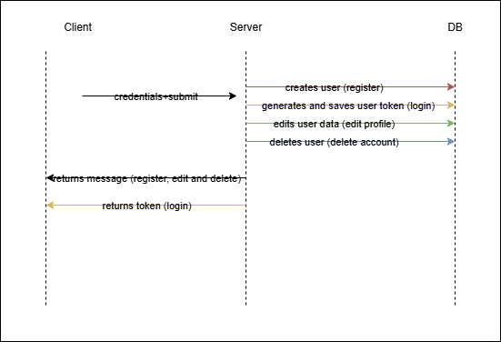
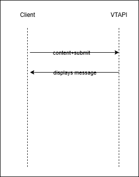

## diagrama de principiu

In diagrama de principiu exista 6 entitati ce comunica intre ele, si anume:
- Browserul, in care se randeaza interfata grafica a aplicatiei
- Clientul (serverul de frontend) care:
    - trimite cereri la serverul de backend
    - trimite cereri la platforma third party CheckFilesAndURLsAPI (Virus Total) 
    - returneze browserului ce trebuie randat 
- Serverul (de backend) care:
    - raspunde cererilor trimise de frontend
    - trimite cereri catre SendMailsAPI (Serverul de mail de la Google)
    - face modificari in baza de date
- CheckFilesAndURLsAPI care primeste link-uri sau fisiere potential malitioase, le verifica si returneaza rezultatul analizei
- SendMailsAPI care face trimiterea efectiva a mailurilor
- DB (baza de date) 

## diagrama de account

In aceasta diagrama s-au reprezentat flow-urile de register, login, edit profile si delete account. Fiecare dintre acestea functioneaza dupa cum urmeaza:
- Utilizatorul acceseaza din browser pagina de Login, Register, Edit profile sau Delete account
- Introduce credentialele care i se cer
    - Pentru inregistrare se cer prenumele, numele, adresa de email, parola + confirmarea parolei
    - Pentru logare trebuie completate doar adresa de email si parola
    - Pentru editare se completeaza campurile dorite
    - Pentru delete nu se completeaza nimic
- Serverul client ia ce a introdus utilizatorul trimite catre backend
In cazul Register si Edit, se valideaza campurile, iar daca ceva nu este in regula (adresa de email este invalida, parola nu respecta formatul standard, etc.) se afiseaza un mesaj de eroare in browser
- Serverul de backend face urmatoarele:
    - verifica daca utilizatorul exista (in cazul loginului) facand o cautare in baza de date dupa adresa de email si in cazul in care exista se face verificarea parolei. Daca oricare din aceste operatii nu merg, se afiseaza un mesaj de eroare
    - trimite cererea si continutul catre DB 
- In baza de date:
    - se creeaza un utilizator in cazul register, se updateaza in cazul edit sau se sterge in cazul delete, iar backend-ul trimite un mesaj de succes
    - se actualizeaza baza de date cu un token in cazul loginului, token care se returneaza la utilizator in browser prin client

## diagrama de check

Aici serverul de client interactioneaza doar cu Virus Total
- utilizatorul introduce datele primite intr-un mail pe care vrea sa-l verifice (adresa celui care a trimis mail-ul + subiectul + mesajul + atasamente aferente)
- clientul face validare pe adresa de mail local (sa respecte pattern-ul unei adrese obisnuite) si pe textul din subiect si mesaj pentru a nu contine cuvinte care sa induca frica, bucurie extrema sau care se gasesc in mesajele spam
- extrage link-urile si fisiere si le trimite la Virus Total
- VT returneaza rezultatele analizelor (daca s-a detectat ceva - un fisier s-a gasit in lista de fisiere malitioase sau ceva masini virtuale pe care s-au verificat datele au fost compromise etc.) se va retuna un scor > 0, ceea ce inseamna ca ceea ce s-a trimis este malitios

Daca s-a detectat ceva, in browser se va afisa un mesaj in care se listeaza ceea ce a fost detectat. Daca nu, se va afisa un mesaj de succes.

## diagrama de send

Similar cu functia ce Check, functia de Send verifica inputul pe care il introduce utilizatorul. Acesta are posibilitatea de a introduce destinatarii manual si/sau sa incarce o lista de adrese dintr-un fisier format .txt sau .csv. Pe langa asta trebuie sa introduca subiectul si mesajul mailului pe care vrea sa-l trimita in campurile corespondente. In plus utilizatorul are posibilitatea sa trimita atasamente multiple.
Aici:
- se face verificarea continutului atat local pentru adresele introduse si pentru spam, cat si pentru link-uri si fisiere extern
- daca ceva nu este ok la verificare, se afiseaza mesaje de eroare
- daca se trece de verificare, continutul se trimite la backend, iar acesta lucreaza cu API-ul de la Google pentru a trimite cate un mail pentru fiecare adresa specificata
- se actualizeaza numarul de request-uri facute pe serverul de backend in baza de date

## ce contine baza de date

- id-ul utilizatorului care se incrementeaza automat cand se inregistreaza un utilizator nou
- prenumele
- numele de familie
- adresa de email
- parola
- sarea
- tokenul de acces
- numarul de accese

## cum se face inregistrarea si autentificarea

Pentru fiecare inregistrare in aplicatie se ia parola introdusa de utilizator, se genereaza o "sare" (sir de caractere random) cu care se "amesteca" parola, rezultand un hash care ulterior se stocheaza in DB.

Pentru autentificare, se genereaza un token (sire de caractere random) care este salvat in DB si returnat in localStorage in browser. La fiecare request de send, se incrementeaza nr de accese, iar cand ajunge la 10, utiliztorul este delogat (tokenul se sterge si nr de accese se reseteaza la 0)